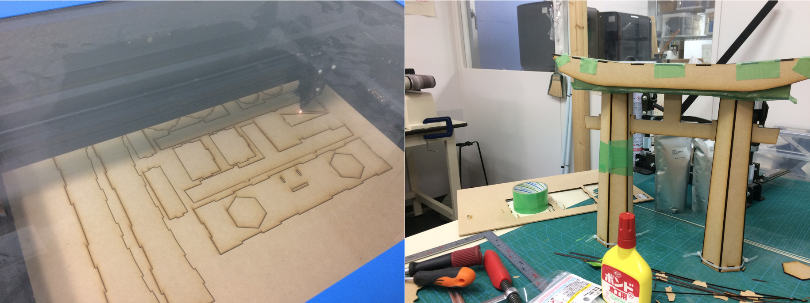
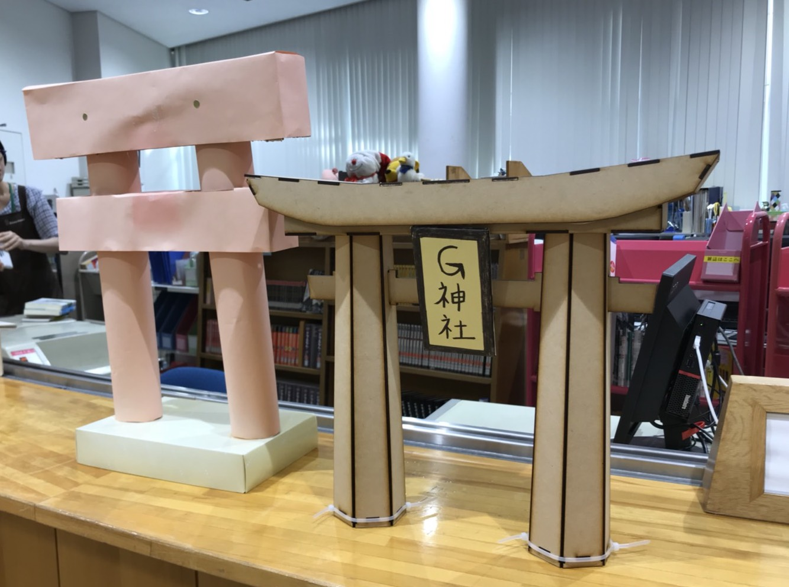

# 鳥居
レーザーカッターで作れる鳥居！

## 経緯
2013年の10月、学習院高等科で図書委員をしていた私は、鳳櫻祭（文化祭）での図書室の展示のテーマが「神社」だったため、モニュメントとして、ダンボールと赤い模造紙を用いて鳥居を作成しました。
数時間ほどかけて作った代物だったわけですが、なぜか図書室から撤去されることはなく、今に至るまで「G神社」は図書室に展示されていて、いつの間にか誰かが割り箸細工で「本殿」まで作っていました。
年月の経過とともに、赤かった模造紙は薄ピンクへと変色し、怪しい造りの割にはまだ崩壊することもなく、（ありがたいことに）まだ安置され続けています。

この際、最新技術を用いてG神社の新バージョンを作ることにしました。すなわち、CADで設計し、レーザーカッターで木材を切り、組み立てるということです。
ご利益があるかは、知らね。

左側は旧G神社、右側が新G神社。

## 鳥居の種類
あまり鳥居に詳しいわけではないですが、どうせならマトモなものを作ろうと、ちょっと調べてみました。鳥居といっても、当然ながら様々な種類があります。
(オリジナルのG神社は、これらのどれにも当てはまらない謎鳥居だったんだな…)
一番それっぽい、Cの明神鳥居を作ってみることにしました。
反りがかっこいいですね。([Wikipedia](https://ja.wikipedia.org/wiki/%E9%B3%A5%E5%B1%85)から引用）

## レーザーカッター用データ
[parts(t2.5)](parts(t2.5).dxf)：板厚2.5mm様のデータ。一枚には収まりきらないはずなので、適当に配置し直してレーザーカットしちゃってください。板厚などを調整する場合は、Fusion 360で開いて、各パーツのthicknessパラメータを編集すること。

## CADデータ
CADが共有できる、A360へのリンクを貼ってあります。Fusion 360で作ったので、それで開くのが一番確実かと。
パラメーターの意味とかは、[メモのPDF](memo.pdf)を参照（TODO：もうちょっとまとめる）。

### 鳥居
* [A360(online)](https://a360.co/2GR7mPZ)
* [F3Z](./鳥居.f3z)
* [STEP](./鳥居.stp)

全部品が含まれているCAD。これだけをダウンロードすれば、全てのパーツもついてくるはず。GitHubにもこれのファイルを載せておきますが、A360上のものが最新。

### パーツ
「鳥居」のCADは、以下のパーツのアセンブリとしてできています。
#### 柱
* [A360](https://a360.co/2KVPw0p)

レーザーカットだと筒状のものを作りづらいので、断面は六角形になっています。古来からの工法である寄木柱からインスピレーションを受けました、とか言ってみたり。

#### 笠木＆島木
* [A360](https://a360.co/2JauRIK)

鳥居の上に水平に横たわってる部分。「G神社」の札が貼れるような三角形のサポートもついている。

#### 貫
* [A360](https://a360.co/2KUevBu)

下の方の水平な部分。
